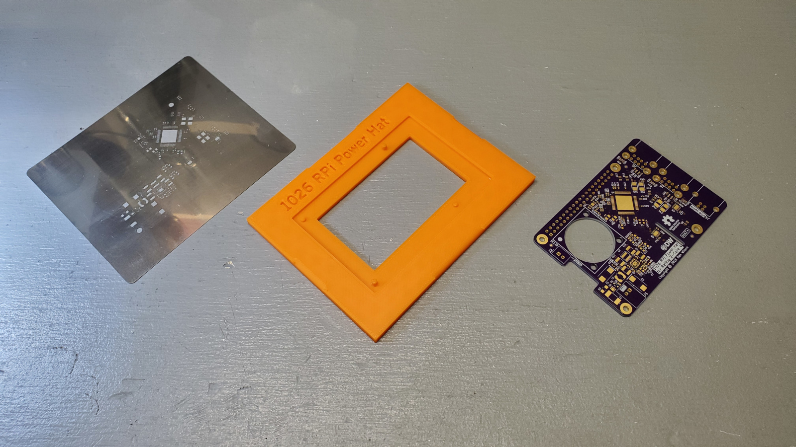
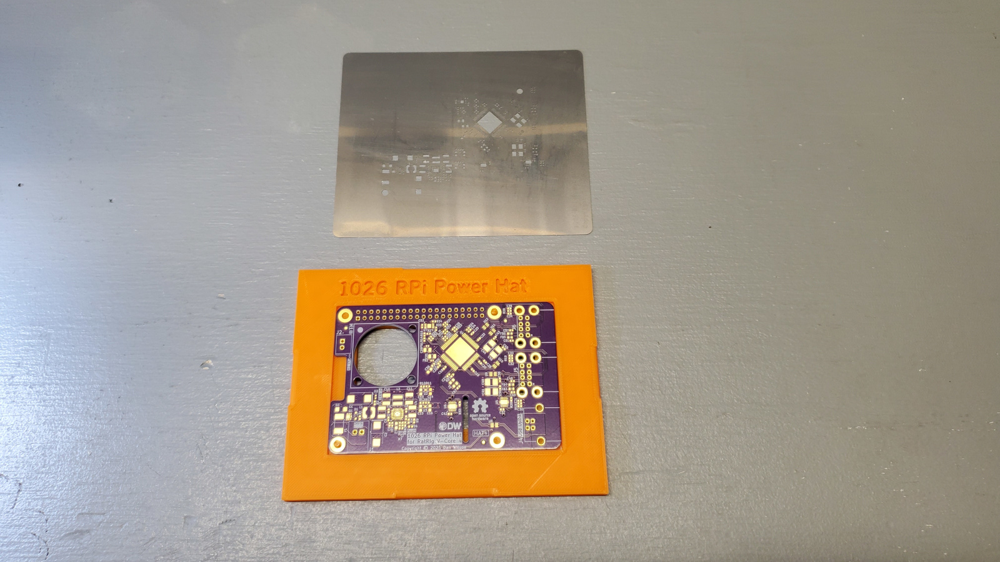
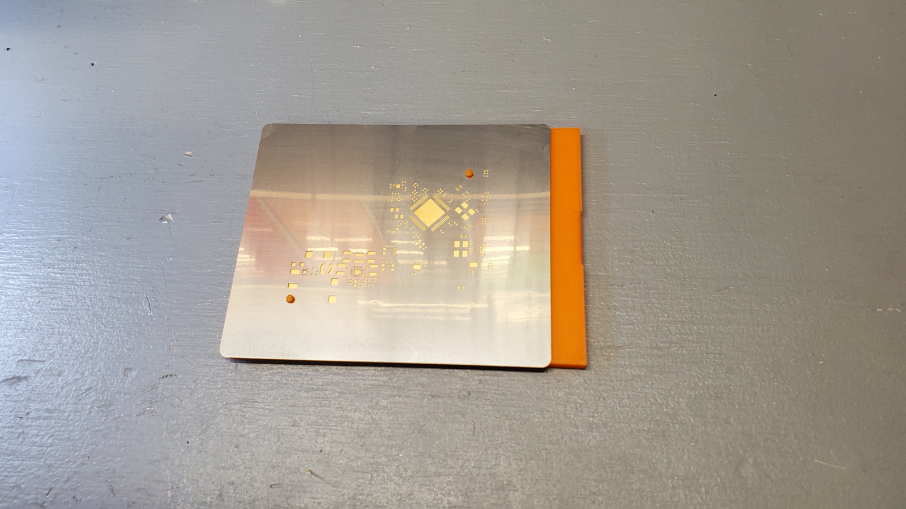

## Introduction
This project is a HAT (hardware attached on top) for the Raspberry Pi, specifically designed for the RatRig V-Core4 3D printer.  This HAT adds some features to the printer that make the electronics wiring easier and more straightforward, and prevent certain problems that can occur with the original RatRig design.


## Features
This HAT does the following:
- Removes the 5V power connection from the Octopus 3D printer control board that was used to power the Raspberry Pi, and replaces it with an on-board, high-current power regulator that can take 24V input directly.  This provides up to 20W (4A of 5V power) to the Raspberry Pi and all of its USB peripherals, rather than relying on the 5V regulator on the Octopus board.
- Provides an additional 4 USB ports to the Raspberry Pi using an on-board USB 2.0 hub IC.  This brings the total number of USB ports available for the 3D printer to 7 instead of 4.  The additional ports can support 2A of current each, with a total of 4A available to be shared among all 7 ports.  The USB hub IC used in this project is the Texas Instruments TUSB8041, a high-quality USB 2.0 hub.
- Includes a small fan that cools the CPU on the Raspberry Pi.  The out-of-the-box design of the V-Core4 has a large fan to cool the entire electronics enclosure, but by default it only runs when the 3D printer's stepper motors are energized.  When they are not, it does not run, and this can cause the Raspberry Pi's temperature to increase into the 60C+ range.  The on-board fan will keep the Pi below 45C when the stepper motors are not running.

## Fabrication
You can have the PCB made at any PCB manufacturer.  The Gerber files are already prepared in the Fabrication Exports folder, the file is [1026 RPi Power Hat](KiCAD%20Project/Fabrication%20Exports/1026%20RPi%20Power%20Hat.zip), these Gerber files are optimized and ready for submission to [OshPark](https://oshpark.com/).  If you want to modify the design, the KiCAD project is available in the KiCAD folder.  The PCB is a 4-layer design, your PCB manufacturer needs to support a minimum trace/space of 5 mil (0.127 mm).

For assembly, the recommended method is to use solder paste and a stencil with a reflow oven or hot air station.  The stencil can be made from the [1026 RPi Power Hat-F_Paste](KiCAD%20Project/Fabrication%20Exports/1026%20RPi%20Power%20Hat-F_Paste.gbr) file in the Fabrication Exports folder.  Inexpensive stencils are available from [OshStencils](https://www.oshstencils.com/#).

## Bill of Materials (BOM)
The bill of materials to assemble this project is available in the file [1026 RPi Power Hat](KiCAD%20Project/BOM/1026%20RPi%20Power%20Hat.csv).  Almost all electronic parts are available from Mouser or Digikey.  One exception is the two inductors (L1, L2), these are probably easiest to purchase directly from CoilCraft, the link is in the BOM file.  Some miscellaneous hardware can be purchased from Amazon, those links are also in the BOM file.

## Assembly - Spreading Solder Paste for Reflow
To assemble the unit yourself, you will need a stencil and solder paste, along with a reflow oven or hot air station.  You can obtain the stencil as described above int the Fabrication section.

There is a solder stencil jig that can be 3D printed in the FreeCAD Project folder.  The file [1026 RPi Power Hat SSJ](FreeCAD%20Project/Solder%20Stencil%20Jig%20V2/1026%20RPi%20Power%20Hat%20SSJ.stl) (STL) can be imported into your preferred slicer and printed with the following settings:

- 0.2 mm layer height
- 0.4 mm nozzle
- 15% infill, use the Gyroid pattern
- PLA material

If you use PrusaSlicer, the file [1026 RPi Power Hat SSJ](FreeCAD%20Project/Solder%20Stencil%20Jig%20V2/1026%20RPi%20Power%20Hat%20SSJ.3mf) (3MF) already has these settings.  You may need to adjust the print speeds for your printer, the speeds in the 3MF file are set for a RatRig V-Minion and are quite fast.

If you want to change aspects of the Solder Stencil Jig, the FreeCAD file is available named [Solder Stencil Jig V2](FreeCAD%20Project/Solder%20Stencil%20Jig%20V2/Solder%20Stencil%20Jig%20V2.FCStd), it is a parametric file that can generate a solder stencil jig for any PCB.

Once you have obtained the manufactured PCB, the stencil, and have printed the solder stencil jig, you should have all 3 of them as such:



Insert the PCB into the solder stencil jig, the registration pins will go through the mounting holes:



Clean the PCB surface with isopropyl alcohol (99%), and clean the stencil the same way.  The PCB should look completely clean under a microscope, with no dust, hair, fibers, or oils on the PCB:


Finally, place the stencil on top of the jig, two of the registration pins go through the stencil to align it:



Spread the solder paste onto the stencil using a paste spreader or old plastic card.  Ensure the solder paste fills all openings in the stencil.  Remove the stencil, then carefully pop out the PCB from the jig.  **Do NOT leave the PCB in the jig while placing the components in the next step!**  The components will dislodge from the PCB when you pop it out later.

Your PCB pads should look like this after solder paste is applied:


## Assembly - Placing Components
Begin placing the surface mount components onto the PCB.  Start with the smallest components (0402 surface mount passives -- resistors, capacitors), and work up to the larger components.  Do not place any through-hole components at this stage.  You can place the components with tweezers or use an air-pick tool if available.

You do not need to perfectly align every component, if the component leads are touching the solder paste on the correct pads and the component is flat, you're fine.  When the board is reflowed, the surface tension of the solder paste will pull the components into very good alignment with the pads.

If the solder paste has expanded and is touching adjacent pads like on the USB chip, it probably will not cause an issue.  When the solder melts, the flux and the solder mask on the PCB will direct the liquid solder to the pad and separate the adjacent pins.  After reflow, check carefully for any solder bridges that may remain.

Double- and Triple- check the polarity of the diodes, LEDs, and capacitors when you place them on the PCB, and check the pin 1 marker of all of the chips.  The silkscreen markings on the PCB match the mark on the component (provided you are using the exact component listed in the BOM).

The 0402 LEDs in particular are very difficult to identify which end is the cathode, so carefully check.

Unlike aluminum electrolytic capacitors where the negative terminal is marked, the tantalum polymer capacitors you will be soldering here have the positive terminal marked.  This matches the silkscreen on the PCB.

Once you get to the larger components, you need to carefully look at the pin alignment, especially on the big USB chip.  It is very easy to misalign the chip by one pin in any direction, so double-check it.

Your PCB should look like this after the components are placed:


## Assembly - Reflow
Reflow the PCB in a reflow oven using the solder paste manufacturer's recommended reflow profile.

If you are going to reflow with a hot air station, you need to be extremely careful with the heat level, as some components like the LEDs can melt if the temperature is too high.  Furthermore, the air flow needs to be low, as some of the very small 0402 components can be blown off the PCB.  If you have a PCB preheater, it will be very helpful here.

## Assembly - Through-Hole Components
Solder the through-hole components onto the PCB in the following order:
The following components are on the TOP side of the PCB, so we solder them on from the back side (bottom):
- 2x JST-XH-2 connectors for input power and the fan.  The fan connector is a top-entry, the input power connector is a side-entry.
- 1x USB-B connector for uplink
- 2x USB-A (2 port) connectors for downlink

The following component is on the BOTTOM side of the PCB, so we solder it on from the front side (top):
- 2x20 pin header

Look at the silkscreen marks on the PCB, they identify the side where the component goes.  Then you solder from the other side.

## Cleaning
It is recommended to clean the PCB after soldering to remove all remaining flux.  Isopropyl alcohol will remove it, but may require light brushing with a toothbrush, and may require multiple passes to remove all of the flux.  Use only distilled water or isopropyl alcohol as solvents for cleaning the PCB.  An ultrasonic cleaner with a detergent also works well if available, but **never use Isopropyl alcohol in an ultrasonic cleaner, use distilled water and detergent only.**

If you have used distilled water for rinsing or in an ultrasonic cleaner, dry the PCB using compressed air, and then further dry it in an oven at 125C for 2 hours.

Once you're finished, your PCB should look like this:


## Fan Preparation
The fan that is to be installed on the PCB needs to have the JST-XH-2 connector (part number XHP-2) installed.  Cut the wires on the fan to a length of approximately 2 inches (5 cm), then crimp on two of the JST contacts (part number SXH-001T-P0.6).  Insert the crimped wire/contacts into the XHP-2 connector, pay attention to the required polarity.  The polarity is marked on the PCB, the fan's red wire goes to the positive (+) terminal on the PCB, this is the terminal closest to the M2.5 mounting screw hole.

Use the following picture as a reference for the fan wiring:


Once the fan is terminated, attach it to the PCB using 3x M2.5 16mm hex cap screws and 3 M2.5 hex nuts on the underside of the PCB.  Ensure the fan is oriented correctly such that the air flow is from the top of the PCB through to the bottom of the PCB.  This will blow air onto the Raspberry Pi's CPU that is below.  For maximum effectiveness, add a passive heat sink to the Raspberry Pi's CPU chip.  There are two arrows on the side of the fan that show you both the rotation direction as well as the air flow direction, you can use these to assist you in orienting the fan in the correct position.

## 5V Regulator Heat Sink
There is a square on the bottom side of the PCB that is 6mm x 6mm in size that is bare copper, not covered by solder mask.  This square is directly underneath the 5V regulator and needs to have a small copper heat sink attached to make sure the regulator stays cool.  The heat sink is listed in the BOM .csv file, and is available from Amazon.  Peel off the protective film on the heat sink and press it to the copper square so that it sticks on.  The fan's air flow will also help cool this heat sink.

## Installation into the RatRig V-Core 4
Prepare a 2-wire power lead to go from the 24V power supply in the V-Core4 to the power HAT.  Terminate the ends of the lead on the 24V power supply side using connectors applicable to your power supply.

Terminate the HAT ends of the leads using a JST-XH-2 connector (part number XHP-2) the same way you did the fan.  Crimp on two of the JST contacts (part number SXH-001T-P0.6).  Insert the crimped wire/contacts into the XHP-2 connector, pay attention to the required polarity.  The polarity is marked on the PCB, the negative lead is on the side of the PCB's JST-XH-2 connector that is closest to the M2.5 mounting screw hole.


You will be assembling the HAT onto the top of your Raspberry Pi using 4 brass PCB standoffs (20mm length of the standoff + a 6 mm length of M2.5 threads) and 4 M2.5 x 6mm screws (pan-head phillips).  The BOM .csv file has an Amazon link to a kit that contains these parts.  Use the following photo to see how the HAT is supposed to be mounted on top of the Raspberry Pi:


Mount the HAT to the Raspberry Pi inside the V-Core4's electronics case.  The final result should look like this:


## USB Port Recommendations
Some of the USB devices on the RatRig V-Core4 have higher bandwidth requirements, and/or are more sensitive to issues than others.  Please use the following recommendations for which devices to plug where:

For all V-Core 4 models:
- Plug the USB-A to USB-B cable that connects the Raspberry Pi to the HAT using:
	- 1 USB-A 2.0 port on the Raspberry Pi (black plastic)
	- The USB-B port on the HAT

For CoreXY and Hybrid models:
- Toolhead / EBB42 board: Use a Raspberry Pi 3.0 (blue plastic) port
- Beacon Probe: Use a Raspberry Pi 3.0 (blue plastic) port
- Octopus Board: Use a Raspberry Pi 2.0 (black plastic) port
- Additional accessories, such as a chamber camera, nozzle camera, or touchscreen: Use a USB 2.0 port (black plastic) on the HAT

For IDEX models:
- Toolhead / EBB42 board 0: Use a Raspberry Pi 3.0 (blue plastic) port
- Toolhead / EBB42 board 1: Use the other Raspberry Pi 3.0 (blue plastic) port
- Beacon Probe: Use a Raspberry Pi 2.0 (black plastic) port
- Octopus Board: Use a USB 2.0 (black plastic) port on the HAT
- VAOC Offset Camera: Use a USB 2.0 (black plastic) port on the HAT
- Additional accessories, such as a chamber camera, nozzle camera, or touchscreen: Use a USB 2.0 port (black plastic) on the HAT

Your final installation should look like this:


## Initial Power-Up
At this point, if everything is connected, you can power on the V-Core4.  The HAT will provide the 5V power to the Pi through the GPIO header.  You should see the green power-on LED lit on the HAT.  If you see the red Fault LED lit up on the HAT, check your input voltage, it must be above 22V for the HAT to power on.  If the voltage checks out OK but you still get a fault LED, this may indicate that you have a short on the HAT PCB.  Re-check all soldered connections.

The fault LED can also indicate an overcurrent condition (more than 20W / 4A used by the Pi + fan + all USB devices).  This should be unlikely, but is something to check.  Remove USB devices one at a time, starting with the accessories that are not part of the RatRig V-Core4 systems and see if the fault light goes out.

## Preparing the HAT in Linux
This HAT conforms to the Raspberry Pi HAT+ specification.  The HAT+ specification requires that the HAT contain an EEPROM with information that tells the Raspberry Pi what the HAT is and its capabilities.  We will program this EEPROM and set up the Raspberry PI to recognize it in the next steps.

### Establish a Command Session to your Raspberry Pi
Using an SSH client like [Putty](https://www.putty.org/), connect to your Raspberry Pi using it's IP address on port 22.  The default username and password for the Raspberry Pi, if you have prepared it using RatRig's instructions, is "pi" and "raspberry".  If you have changed these, use your own username and password that you have established.

Once in the command terminal, execute the following commands to prepare the EEPROM:

``sudo -i

The above command will again ask you for the password, the default is "raspberry".

```
apt install cmake
cd /root
git clone https://github.com/raspberrypi/utils.git
cd utils/eeptools
cmake .
make
make install
wget https://github.com/wilsondr9999/1026-RPi-Power-Hat/blob/master/Extras/Linux%20EEPROM%20Preparation/myhat.eep
wget https://github.com/wilsondr9999/1026-RPi-Power-Hat/blob/master/Extras/Linux%20EEPROM%20Preparation/rr-vcore4-powerhat.dtbo
apt install i2c-tools
dtoverlay i2c-gpio i2c_gpio_sda=0 i2c_gpio_scl=1 bus=9
i2cdetect -y 9
```

 The final command above should show you a matrix of detected I2C addresses on the GPIO header.  The HAT is supposed to be detected on address 53, and the number 53 should show up in the matrix.  If it does not, check the HAT for soldering problems.  If it does, proceed with flashing the EEPROM:

```
./eepflash.sh -w -t=24c32 -d=9 -a=53 -f=myhat.eep
```

Make sure the above command completes successfully and does not issue an error message.

```
cp rr-vcore4-powerhat.dtbo /boot/overlays/
sh -c "echo rr-vcore4-powerhat.dtbo >> /boot/config.txt"
```

Now we can reboot the Pi:

```
reboot
```

Once the Pi is rebooted, you can verify that the USB hub is detected and functioning.  Connect to a command session again using your SSH client, and issue the following command:

```
lsusb
```

In the device listing, you should see the HAT's USB hub:

```
Bus 001 Device 005: ID 0451:8142 Texas Instruments, Inc. TUSB8041 4-Port Hub
```

You should also be able to see the RatRig printer devices connected:

```
Bus 001 Device 006: ID 1d50:614e OpenMoko, Inc. stm32f446xx
Bus 001 Device 004: ID 04d8:e72b Microchip Technology, Inc. Beacon RevH
Bus 001 Device 003: ID 1d50:614e OpenMoko, Inc. stm32g0b1xx
Bus 001 Device 002: ID 2109:3431 VIA Labs, Inc. Hub
```

You should also see any additional accessory devices you have added, for example:

```
Bus 001 Device 008: ID 04d9:8030 Holtek Semiconductor, Inc. BTT-HDMI7
Bus 001 Device 007: ID 046d:0825 Logitech, Inc. Webcam C270
```

## Licensing
This project is licensed under two separate licenses:

The hardware design is licensed under the CERN Open Hardware License Version 2 - Weakly Reciprocal.  This copyleft license requires that if you use this device in your product or redistribute this device or its derivatives in any way, that you must:

- Provide the end-users with this license and copyright notice.
- State any changes you have made to the original device, its files, or its documentation.
- Publish your modifications of the device, its files, and its documentation under the same license.
- Indicate to the end-user the original source (this GitHub archive) and that your work is a derivative and/or redistribution.
- The license is "weakly reciprocal" in that it only requires these actions for the modified device itself, not the entire end product that you have incorporated it into.  The rest of the product does not have to follow this license and is not affected by this license.


The documentation, images, and instructions are licensed under the Creative Commons Attribution-ShareAlike 4.0 International Public License.  This copyleft license requires that if you use this device in your product or redistribute this device or its derivatives in any way, that you must:

- Provide the end-users with this license and copyright notice.
- State any changes you have made to the original device, its files, or its documentation.
- Publish your modifications of the device, its files, and its documentation under the same license.
- Indicate to the end-user the original source (this GitHub archive) and that your work is a derivative and/or redistribution.

As stated by the licenses, all uses of this project require attribution and require open-source release under the same licenses.
